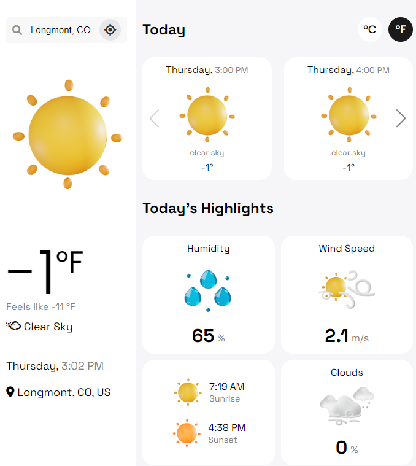

<!---

    <b></b>

-->

## Webapp code based on https://github.com/hicodersofficial/weather-app.
### Hosted on Netlify. 

See that repository's README for installation and configuration details. I did not need to change any of those details
to get this app up and running. 

### Preview of project this was cloned from: 
[Currently broken] app is hosted at react-wander.netlify.app
🌐 **[Live Preview](https://react-wander.netlify.app)**

Here's a preview of what this webapp generates:

